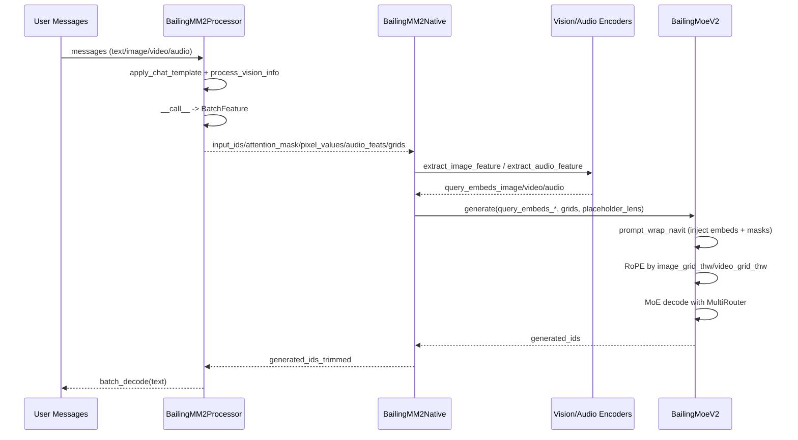
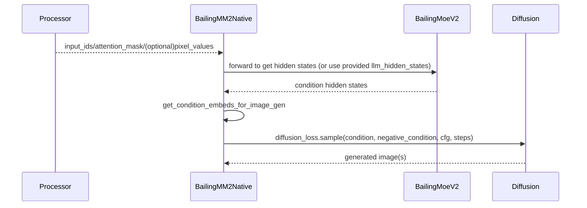

# Ming / BailingMM2 架构文档（代码层）

本文档基于仓库当前代码，描述 Ming（产品名）在代码中的 BailingMM2 实现架构，重点覆盖：

- 模型初始化链路
- 推理执行链路（文本/多模态）
- 模块连接关系（接口与关键张量）
- 可选分支（Image Generation / Talker）

---

## 1. 总览

### 1.1 命名关系

- 对外产品名：**Ming**（如 Ming-flash-omni-2.0）
- 代码实现名：**Bailing**（如 `BailingMM2NativeForConditionalGeneration`）

同一套系统，名称不同。

### 1.2 代码分层

1. 入口层  
   - `README.md`, `cookbook.ipynb`, `test_infer.py`, `examples/*`
2. 编排层（多模态总装）  
   - `modeling_bailingmm2.py`
3. 主干 LLM 层（MoE）  
   - `modeling_bailing_moe_v2.py`
4. 模态处理层（视觉/音频/Processor）  
   - `processing_bailingmm2.py`  
   - `image_processing_bailingmm2.py`  
   - `audio_processing_bailingmm2.py`  
   - `qwen3_moe_vit.py`  
   - `modeling_whisper_encoder.py`
5. 可选扩展层  
   - 图像生成：`diffusion/*`, `bizgen/*`  
   - 语音生成：`modeling_bailing_talker.py`, `talker_module/*`, `AudioVAE/*`

---

## 2. 配置与 AutoClass 映射

### 2.1 模型配置（`config.json`）

- 主架构：`BailingMM2NativeForConditionalGeneration`
- 三个核心子配置：
  - `llm_config` -> `BailingMoeV2ForCausalLM`
  - `vision_config` -> `Qwen3MoeVisionTransformer`
  - `audio_config` -> `WhisperAudioEncoder`（含 whisper encoder 参数）

### 2.2 Processor 映射（`preprocessor_config.json`）

- `AutoProcessor` -> `processing_bailingmm2.BailingMM2Processor`
- `AutoImageProcessor` -> `BailingMM2ImageProcessor`
- `AutoFeatureExtractor` -> `BailingMM2AudioProcessor`

---

## 3. 初始化架构（from_pretrained）

入口：`BailingMM2NativeForConditionalGeneration.from_pretrained(...)`  
文件：`modeling_bailingmm2.py`

### 3.1 默认主干加载（`load_vlm=True`）

`__init__` 主要构造：

1. 视觉编码器  
   `self.vision = Qwen3MoeVisionTransformer(self.config.vision_config)`
2. 音频编码器  
   `self.audio = WhisperAudioEncoder(**self.config.audio_config.whisper_encoder_config)`
3. 语言模型  
   `self.model = BailingMoeV2ForCausalLM(self.config.llm_config)`
4. 对齐层
   - `linear_proj`：视觉特征投影到 LLM hidden size
   - `linear_proj_audio`：音频特征投影到 LLM hidden size

### 3.2 可选加载：图像生成分支

参数：`load_image_gen=True`  
调用：`load_image_gen_modules(...)`

加载内容：

- `query_tokens_dict`（多尺度可学习 token）
- `connector`（额外因果模型用于条件变换）
- `proj_in / proj_out`
- `diffusion_loss`（`SD3Loss` / `SANALoss` / `ZImageLoss`）
- 可选 `byt5` 文本条件增强

### 3.3 可选加载：Talker 分支

参数：`load_talker=True`  
加载：

- `model.talker = BailingTalker2.from_pretrained(...)`
- `model.talker_vae = AudioVAE.from_pretrained(...)`

---

## 4. 主执行链路（多模态文本生成）

以 `test_infer.py` 的 `generate()` 为标准路径。

### 4.1 Step A：消息到模型输入（Processor 侧）

调用序列：

1. `processor.apply_chat_template(messages, ...)`  
   生成统一 prompt 文本（含 system/user/assistant 结构）。
2. `processor.process_vision_info(messages)`  
   从消息内容中提取并读取 image/video/audio。
3. `processor(...)`  
   输出 `BatchFeature`，关键字段：
   - 文本：`input_ids`, `attention_mask`
   - 图像：`pixel_values`, `image_grid_thw`
   - 视频：`pixel_values_videos`, `video_grid_thw`
   - 音频：`audio_feats`, `audio_feats_lengths`, `audio_placeholder_loc_lens`

其中占位符扩展逻辑：

- `_expand_image_tokens`：`<IMAGE>` -> `<image> + N*<imagePatch> + </image>`
- `_expand_video_tokens`：`<VIDEO>` -> `<video> + N*<framePatch> + </video>`
- `_expand_audio_tokens`：`<AUDIO>` -> `<audio> + N*<audioPatch> + </audio>`

作用：保证 token 序列与后续特征 patch 数量一一对应。

### 4.2 Step B：BailingMM2 顶层 generate

入口：`BailingMM2NativeForConditionalGeneration.generate(...)`

1. 视觉特征提取（如有图像）
   - 输入：`pixel_values`, `image_grid_thw`
   - 调用：`extract_image_feature(...)`
   - 输出：`image_embeds`

2. 视频特征提取（如有视频）
   - 输入：`pixel_values_videos`, `video_grid_thw`
   - 调用：`extract_image_feature(...)`
   - 输出：`video_embeds`

3. 音频特征提取（如有音频）
   - 输入：`audio_feats`, `audio_feats_lengths`
   - 调用：`extract_audio_feature(...)`
   - 输出：`audio_embeds`, `audio_embeds_lengths`

4. 进入 LLM 生成
   调用 `self.model.generate(...)`，传入：
   - `query_embeds_image`
   - `query_embeds_video`
   - `query_embeds_audio`
   - `query_embeds_audio_lengths`
   - `placeholder_audio_loc_lens`
   - `image_grid_thw`
   - `image_grid_thw_video`

### 4.3 Step C：LLM 内部融合与解码

入口：`BailingMoeV2ForCausalLM.forward / generate`

#### 4.3.1 多模态注入（`prompt_wrap_navit`）

位置：`BailingMoeV2Model.prompt_wrap_navit(...)`

- `prompt_wrap_vision(...)`
  - 依据 `input_ids == image_patch_token / video_patch_token`
  - 将对应 token 的 embedding 替换为视觉/视频特征
- `prompt_wrap_audio(...)`
  - `patch_continuous_features(...)`
  - 依据 `placeholder_audio_loc_lens` 将连续音频特征写入 embedding
  - 同时构建 `audio_mask`

返回：

- `inputs_embeds`（已注入多模态）
- `vision_mask`
- `audio_mask`

#### 4.3.2 位置编码与 RoPE

`image_grid_thw` / `image_grid_thw_video` 参与 3D/video RoPE 的位置索引计算。  
这保证图像/视频 token 的空间与时序结构在注意力中被正确编码。

#### 4.3.3 MoE Router 分流

`BailingMoeV2SparseMoeBlock.forward(hidden_states, image_mask, audio_mask)`

在 `router_type=MultiRouter` 时：

- 同时计算 `gate / image_gate / audio_gate`
- 对视觉 token 用 `image_gate` 路由
- 对音频 token 用 `audio_gate` 路由
- 对文本 token 用默认 `gate` 路由

通过 `image_mask/audio_mask` 完成 token 级别路由切换。

#### 4.3.4 自回归生成与缓存

`prepare_inputs_for_generation(...)` 管理：

- `past_key_values`
- 裁剪后的 `input_ids`
- 动态 `position_ids`
- 继续携带多模态上下文参数（`query_embeds_*`, `grid_thw`, masks）

最终 `lm_head` 输出 logits，迭代直到 EOS 或达到 `max_new_tokens`。

### 4.4 Step D：输出解码

上层调用：

- `generated_ids_trimmed = out_ids[len(in_ids):]`
- `processor.batch_decode(...)`

输出最终文本。

---

## 5. 模块连接契约（I/O 视角）

### 5.1 Processor -> Model 契约

| 字段 | 生产者 | 消费者 | 说明 |
|---|---|---|---|
| `input_ids` | `BailingMM2Processor` | `BailingMM2.generate -> LLM` | 文本 token 序列（含模态 patch token） |
| `attention_mask` | `BailingMM2Processor` | `LLM.forward` | 有效 token mask |
| `pixel_values` | `BailingMM2ImageProcessor` | `extract_image_feature` | 图像 patch 序列 |
| `image_grid_thw` | `BailingMM2ImageProcessor` | `vision encoder` + RoPE | 图像 token 网格结构 |
| `pixel_values_videos` | `BailingMM2ImageProcessor` | `extract_image_feature` | 视频 patch 序列 |
| `video_grid_thw` | `BailingMM2ImageProcessor` | `vision encoder` + RoPE | 视频时空网格结构 |
| `audio_feats` | `BailingMM2AudioProcessor` | `extract_audio_feature` | 音频特征序列 |
| `audio_feats_lengths` | `BailingMM2AudioProcessor` | `extract_audio_feature` | 音频段长度 |
| `audio_placeholder_loc_lens` | `BailingMM2Processor` | `prompt_wrap_audio` | 音频占位位置与长度 |

### 5.2 编排层 -> LLM 契约

| 字段 | 生产者 | 消费者 | 作用 |
|---|---|---|---|
| `query_embeds_image` | `extract_image_feature` | `prompt_wrap_navit` | 替换图像 patch token embedding |
| `query_embeds_video` | `extract_image_feature` | `prompt_wrap_navit` | 替换视频 patch token embedding |
| `query_embeds_audio` | `extract_audio_feature` | `prompt_wrap_audio` | 覆盖音频占位段 embedding |
| `query_embeds_audio_lengths` | `extract_audio_feature` | `patch_continuous_features` | 控制每段音频写入长度 |
| `image_grid_thw/video_grid_thw` | Processor | LLM RoPE index | 位置编码结构信息 |

### 5.3 LLM 内部契约

| 字段 | 生产者 | 消费者 | 作用 |
|---|---|---|---|
| `vision_mask` | `prompt_wrap_navit` | MoE block | 标识视觉 token 路由 |
| `audio_mask` | `prompt_wrap_audio` | MoE block | 标识音频 token 路由 |
| `past_key_values` | 每步 forward | 下一步 generation | 增量解码缓存 |

---

## 6. 可选分支连接

### 6.1 Image Generation 分支（`image_gen=True`）

> 代码主入口：`modeling_bailingmm2.py`

#### 6.1.1 初始化与构建（在 `from_pretrained` 阶段）

触发条件：`BailingMM2NativeForConditionalGeneration.from_pretrained(..., load_image_gen=True)`

调用链：

1. `from_pretrained`  
2. `load_image_gen_modules(inference_model_path, torch_dtype, load_image_gen_diffusion, load_image_gen_others, device)`

`load_image_gen_modules` 的构建内容分两部分：

1) `load_image_gen_others=True`（条件编码器部分）

- `query_tokens_dict`：按 `img_gen_scales`（默认例如 `[4, 8, 16]`）初始化并加载多尺度可学习 token
- `connector`：`AutoModelForCausalLM.from_pretrained(..., subfolder="connector")`，并设置 `self_attn.is_causal=False`
- `proj_in`：LLM hidden size -> connector hidden size
- `proj_out`：connector hidden size -> diffusion 条件维度（`diffusion_c_input_dim`）
- 可选 `ByT5`：
  - `load_byt5(...)` 加载 `byt5_model + byt5_mapper + tokenizer`
  - 用于将文本提示附加到 condition embeds

2) `load_image_gen_diffusion=True`（扩散采样器部分）

根据 `mlp/config.json` 中 `dit_type` 构建不同后端：

- `dit_type` 包含 `"sd3"` -> `SD3Loss`
- `dit_type` 包含 `"sana"` -> `SANALoss`
- `dit_type` 包含 `"zimage"` -> `ZImageLoss`

最后设置 `self.loaded_image_gen_modules = True`。

#### 6.1.2 执行路径（`generate(image_gen=True)`）

执行主链：

1. 准备条件向量：
   - 若直接给 `image_gen_condition_embeds`：直接使用
   - 否则调用 `get_condition_embeds_for_image_gen(...)`
2. `get_condition_embeds_for_image_gen(...)` 内部：
   - `append_input_ids_with_multiscale_learnable_tokens`：在文本序列中插入多尺度生成 token 段
   - `appand_learnable_tokens`：把 learnable query token 与真实图像 token 对齐
   - `self.model.forward(..., output_hidden_states=True)`：取末层 hidden states
   - `gen_mask` 选出生成 token 对应 hidden
   - `proj_in -> connector -> proj_out -> normalize` 得到 diffusion condition embeds
3. 负向条件（negative）构建：
   - 优先级 1：`image_gen_negative_condition_embeds`
   - 优先级 2：`image_gen_negative_input_ids / image_gen_negative_llm_hidden_states` 走同样编码链
   - 缺省：`condition_embeds * 0.0`
4. 调用扩散采样：
   - `self.diffusion_loss.sample(...)`
   - 关键参数：`steps / seed / cfg / image_cfg / cfg_mode / height / width / ref_x`
5. 输出后处理：
   - 按 `process_ratio` 记录的原尺寸映射 resize
   - `image_gen_return_batch=False` 且 batch=1 时返回单张 PIL

#### 6.1.3 可配置能力与行为差异

| 维度 | 参数/模块 | 行为差异 |
|---|---|---|
| 条件来源 | `image_gen_condition_embeds` vs 文本编码 | 前者跳过 LLM 条件提取，后者实时从 `input_ids` 推导 |
| 负向条件 | `image_gen_negative_*` | 可做 classifier-free guidance 的负提示控制 |
| 扩散后端 | `dit_type: sd3/sana/zimage` | 三种 `*Loss` 实现，采样器与内部结构不同 |
| 文本增强 | `ByT5` 是否存在 | 存在时将 ByT5 映射特征拼接到 condition 序列 |
| 参考图 | `image_gen_pixel_values_reference` | 作为 `ref_x` 注入采样器，支持参考图约束 |
| 分辨率策略 | `image_gen_highres / height / width / aspect` | 自动对齐到可采样网格，并在输出阶段 resize 回目标比例 |

---

### 6.2 Talker 分支（语音生成）

> 主代码：`modeling_bailing_talker.py`，示例入口：`test_talker.py`

#### 6.2.1 初始化与构建

在主模型侧通过：

- `BailingMM2NativeForConditionalGeneration.from_pretrained(..., load_talker=True)`  
  挂载：
  - `model.talker = BailingTalker2.from_pretrained(<path>/talker)`
  - `model.talker_vae = AudioVAE.from_pretrained(<path>/talker/vae)`

`BailingTalker2.__init__` 关键构建：

1. 文本 backbone：
   - `Qwen2Config.from_pretrained(<name_or_path>/llm)`
   - `Qwen2Model(self.model_config)`
2. 语音 token 生成器：
   - `CFM(DiT(...), steps=config.steps)`
3. 映射与控制头：
   - `Aggregator`（latent -> llm embedding）
   - `stop_head`（结束判定）
   - `spk_head`（声纹向量映射到 LLM hidden）
4. 声纹提取：
   - `SpkembExtractor(campplus.onnx)`（ONNXRuntime CPU 执行）
5. 并发/图优化：
   - `CFMGraphExecutorPool`（CUDA Graph 复用）
   - `model_graph_pool`（Qwen2 forward 的 graph/cache 复用）
6. 文本规范化与音色配置：
   - `TalkerTN`、`voice_name.json`

> `BailingTalkerConfig` 在仓库内是轻量壳（`pass`），实际字段由 `from_pretrained` 读取权重目录中的配置并在运行时使用（如 `flowmodel/steps/patch_size/history_patch_size/name_or_path`）。

#### 6.2.2 执行路径（token -> wav）

核心链路（以 `instruct_audio_generation` / `omni_audio_generation` 为例）：

1. prompt 处理：
   - `get_prompt_emb(...)`  
   - 必要时 `register_prompt_wav(...)`：
     - `audio_detokenizer.encode_latent(...)` 得 `prompt_wav_lat`
     - `Aggregator` 得 `prompt_wav_emb`
     - `SpkembExtractor + spk_head` 得 `spk_emb`
2. 组装输入：
   - `omni_audio_generation_func(...)` 拼接 system/user prompt、指令、`<audio>` 占位
   - 将 `spk_emb` 和 `prompt_wav_emb` 注入 `inputs_embeds` 指定位置
3. token 自回归生成：
   - `generate(inputs_embeds, prompt_wav_lat, cfg, sigma, temperature)`
   - 每步执行：
     - `Qwen2Model` 前向（带 `StaticCache`）
     - `CFM sample` 生成 latent token
     - `Aggregator` 生成下一步输入 embedding
     - `stop_head` 判停
4. token 解码为波形：
   - `tts_job -> token2wav(audio_detokenizer.decode(...))`
   - 支持 `stream=True` 流式、`stream=False` 整句
   - `silence_holder` 做静音裁剪/拼接

#### 6.2.3 不同任务/模式差异

| 维度 | 分支 | 差异 |
|---|---|---|
| 任务类型 | `taskname` | `TTA/BGM/STYLE/SPEECH_BGM/SPEECH_SOUND/PODCAST`：整体直接生成；`TTS/EMOTION/BASIC/DIALECT/IP`：按文本分句切片逐段生成 |
| 说话人条件 | `use_spk_emb` | 使用参考音频提取声纹并注入 |
| 零样本说话人 | `use_zero_spk_emb` | 无参考音频时注入零向量声纹 |
| 声线模板 | `voice_name` | 命中 `voice_name.json` 时自动带入 `prompt_text + prompt_wav_path` |
| 输出策略 | `stream` | 流式逐块返回音频；非流式一次返回整段 |
| 采样风格 | `cfg/sigma/temperature/max_decode_steps` | 控制 token 生成风格、随机性和最大长度 |

#### 6.2.4 与主 VLM 路径的关系

- Talker 不走 `BailingMM2 -> BailingMoeV2` 的常规文本生成路径。
- 它是独立的语音生成子系统（Qwen2 + CFM/DiT + VAE），通过 `load_talker=True` 挂载到主模型对象，便于统一分发与部署。

---

## 7. 端到端时序（简化）

```text
messages
  -> Processor(chat template + multimodal preprocess)
  -> input_ids / attention_mask / pixel_values / audio_feats / grids / placeholder_lens
  -> BailingMM2.generate
      -> vision/audio encode + projector
      -> BailingMoeV2.generate
          -> prompt_wrap_navit (inject embeds + masks)
          -> RoPE by grid_thw
          -> MoE decode with MultiRouter
          -> logits / next token
  -> decode text
```

---

## 8. 关键设计点

1. **统一 token 序列 + 外部特征注入**  
   文本中先放 patch 占位，后在 embedding 层替换/覆盖，避免在 decoder 结构内硬编码多模态分支。

2. **结构信息显式传递**  
   `image_grid_thw/video_grid_thw` 贯穿预处理、编码与 RoPE，保持时空一致性。

3. **模态感知 MoE 路由**  
   `MultiRouter + mask` 让不同模态 token 使用不同门控策略。

4. **可插拔扩展**  
   image_gen/talker 都通过 `from_pretrained` 开关挂载，不侵入基础文本推理路径。

---

## 9. 参考入口

- 文本/多模态推理：`test_infer.py`
- 图像生成示例：`test_infer_imagegen.py`
- 主模型实现：`modeling_bailingmm2.py`
- 主干 LLM 实现：`modeling_bailing_moe_v2.py`
- Processor：`processing_bailingmm2.py`

---

## 10. 函数级连接清单（可用于代码走查）

### 10.1 输入侧连接（Message -> BatchFeature）

| 上游函数 | 下游函数 | 连接对象 |
|---|---|---|
| `BailingMM2Processor.apply_chat_template` | `BailingMM2Processor.__call__` | 格式化后文本 prompt |
| `bailingmm_utils.process_vision_info` | `BailingMM2Processor.__call__` | 图片/视频/音频原始载荷 |
| `BailingMM2Processor._expand_image_tokens` | `tokenizer(...)` | `<IMAGE>` 替换为 patch token 序列 |
| `BailingMM2Processor._expand_video_tokens` | `tokenizer(...)` | `<VIDEO>` 替换为帧 patch token 序列 |
| `BailingMM2Processor._expand_audio_tokens` | `tokenizer(...)` | `<AUDIO>` 替换为音频 patch token 序列 |
| `BailingMM2ImageProcessor.preprocess` | `BailingMM2Processor.__call__` | `pixel_values`, `image_grid_thw`, `video_grid_thw` |
| `BailingMM2AudioProcessor.preprocess` | `BailingMM2Processor.__call__` | `audio_feats`, `audio_feats_lengths`, `encoder_feats_lengths` |

### 10.2 编排层连接（BatchFeature -> Query Embeds）

| 上游函数 | 下游函数 | 连接对象 |
|---|---|---|
| `BailingMM2NativeForConditionalGeneration.generate` | `extract_image_feature` | `pixel_values`, `image_grid_thw` |
| `BailingMM2NativeForConditionalGeneration.generate` | `extract_image_feature` | `pixel_values_videos`, `video_grid_thw` |
| `extract_image_feature` | `BailingMoeV2ForCausalLM.generate` | `query_embeds_image/query_embeds_video` |
| `extract_audio_feature` | `BailingMoeV2ForCausalLM.generate` | `query_embeds_audio/query_embeds_audio_lengths` |
| `BailingMM2Processor.__call__` | `BailingMoeV2ForCausalLM.generate` | `placeholder_audio_loc_lens` |

### 10.3 LLM 内部连接（Query Embeds -> Decoder）

| 上游函数 | 下游函数 | 连接对象 |
|---|---|---|
| `BailingMoeV2Model.prompt_wrap_vision` | `BailingMoeV2Model.forward` | 替换后的 `inputs_embeds` |
| `BailingMoeV2Model.prompt_wrap_audio` | `BailingMoeV2Model.forward` | 替换后的 `inputs_embeds` + `audio_mask` |
| `BailingMoeV2Model.prompt_wrap_navit` | `BailingMoeV2SparseMoeBlock.forward` | `image_mask` / `audio_mask` |
| `BailingMoeV2Model.forward` | `get_t_scale_rope_index/get_rope_index` | `image_grid_thw/video_grid_thw` |
| `BailingMoeV2SparseMoeBlock.forward` | experts 执行 | `topk_idx/topk_weight`（按模态 mask 分流） |
| `BailingMoeV2ForCausalLM.forward` | `lm_head` | `hidden_states -> logits` |
| `BailingMoeV2ForCausalLM.prepare_inputs_for_generation` | 下一步 `forward` | cache + 裁剪输入 + 多模态上下文 |

### 10.4 Image Gen 分支连接（可选）

| 上游函数 | 下游函数 | 连接对象 |
|---|---|---|
| `BailingMM2NativeForConditionalGeneration.generate(image_gen=True)` | `get_condition_embeds_for_image_gen` | LLM hidden states / image embeds |
| `get_condition_embeds_for_image_gen` | `connector -> proj_out` | diffusion 条件向量 |
| `load_image_gen_modules` | `self.diffusion_loss.sample` | diffusion 模块实例与参数 |

---

## 11. Mermaid 时序图

### 11.1 标准多模态文本生成



### 11.2 图像生成分支



